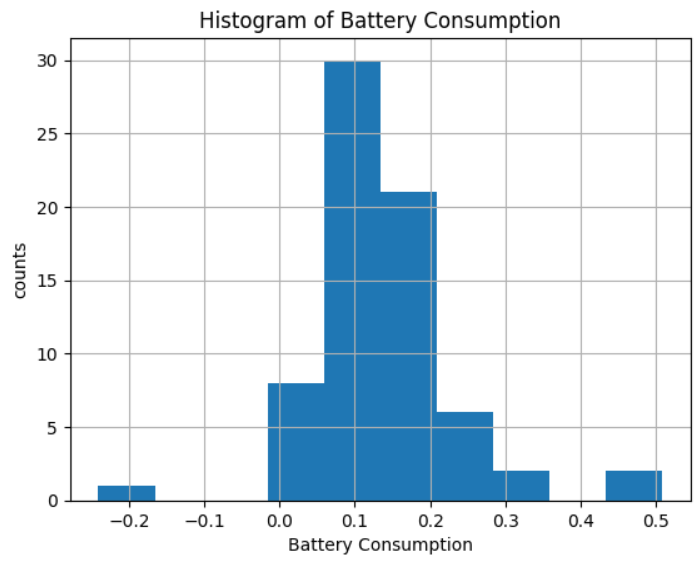

1. The column names of the feature(s) you plan to use for the final project, and the target outcome you plan to determine using these features.

- features:
usin overview data:
  - Environmental data (temperature, elevation, etc.)
  - Vehicle data (speed, throttle, etc.)
  - Heating circuit data (indoor temperature, heating power, etc.)
  - except Battery Data (because it relates to our prediction value)

- target outcome: Soc difference (battery consumption) prediction

2. Your initial plan for any feature engineering (e.g. adding a Boolean for weekend vs. weekday or taking the ratio of two other features).

- get_dummies for feature 
  - "Weather" e.g. sunny: 0, slightly cloudy: 1, ...
  - "Date" e.g. weekday: 0, weekend: 1
  - "Date" e.g. winter: 0, summer: 1
  - "acceleration" e.g. accelerate: 0, hit a break: 1
  - "Distance" e.g. short distance: 0, long distance: 1

- new features:
  - speed change (acceleration) = from velocity / delta time
  - energy rate = heating power /  battery voltage
  - battery temperature difference = (battery temperature end - start)
  - average velocity = Distance / Duration

3. If you plan to use any sort of method for dealing with imbalanced data, detail your overall approach (e.g. "will oversample class XYZ", or "will create synthetic data using SMOTE"). If you do not intend to use any techniques to deal with imbalanced data, explain why it is not necessary (e.g. "all features are at worst imbalanced 7:3").

Since the distribution seems in a normal distribution (with several outliers), we do not intend to use any strategies to deal with imbalanced data.

